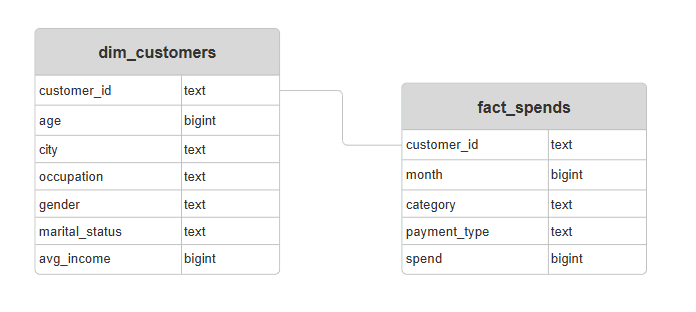
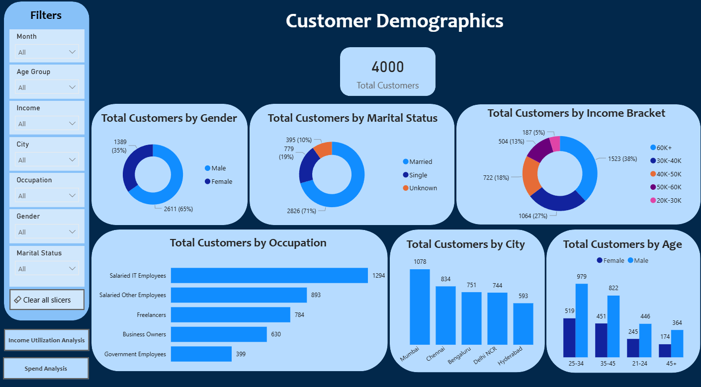
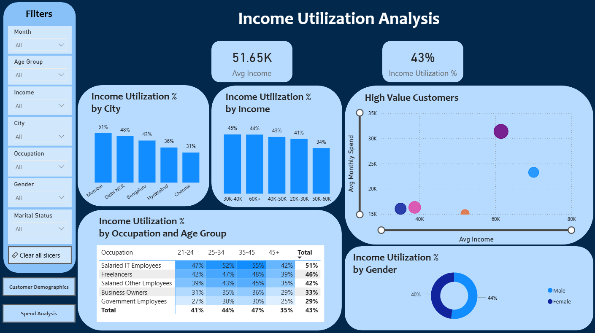
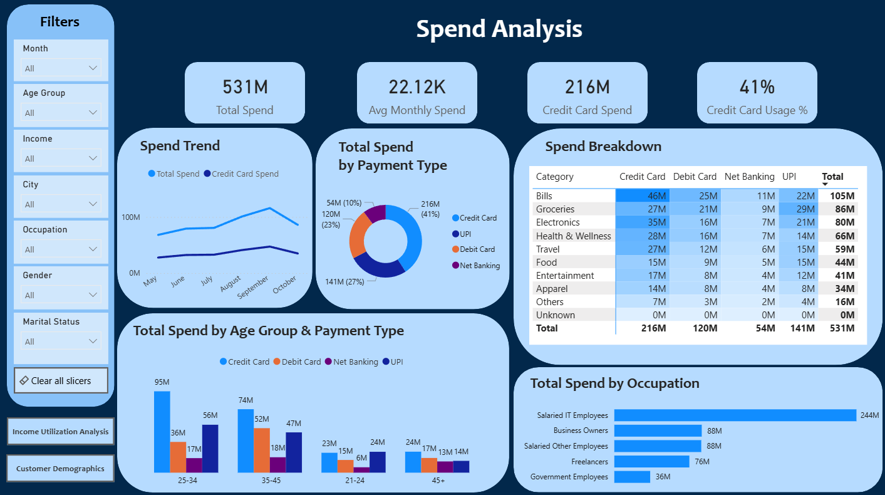
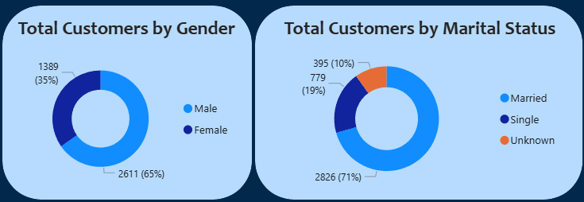
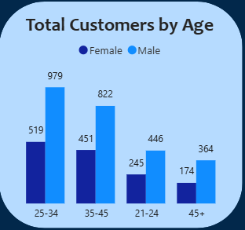

# Banking Industry Credit Card Optimization using Customer Analytics

A leading financial institution operating in India is planning to launch a new credit card product to expand its customer base and increase digital payment adoption. The management team wanted a data-driven approach to identify high-value customer segments, understand spending behavior, and design optimized credit card features aligned with market trends.

As a Data Analyst, I was assigned to analyze a pilot dataset of 4,000 customers across five major metropolitan cities. The goal was to uncover insights that would guide product strategy, marketing focus, and feature optimization for the upcoming credit card launch.

Insights and recommendations are provided on the following key areas:
- Customer Demographics Analysis
- Income Utilization & Credit Potential
- Spending & Payment Behavior
- Target Segmentation & Product Strategy

**SQL Queries** – [Click Here](sql) 

**Juppyter Notebooks** – [Click Here](jupyter_notebook) 

**Interactive Power BI Dashboard** – [Click Here](https://app.powerbi.com/view?r=eyJrIjoiNjc3ODhlYjYtOWM3Zi00OTBiLTk3ZDEtMDQ3MTUxMDBjNGQ4IiwidCI6ImM2ZTU0OWIzLTVmNDUtNDAzMi1hYWU5LWQ0MjQ0ZGM1YjJjNCJ9)  

---

## Data Structure and Preparation  

The database consisted of **2 tables**:  
- **dim_customers** – customer details  
- **fact_spends** – spend details  

 
**Entity Relationship Diagram (ERD)**  
  

### Data Cleaning & Preparation  
Data cleaning was performed using **Python (Pandas) in Jupyter Notebook**.

Key steps included:
- Removing duplicate records
- Standardizing categorical variables
- Fixing typographical inconsistencies
- Handling null values
- Identifying and treating outliers
- Creating derived columns : age_group, income_bracket.
These steps ensured analytical consistency and improved data reliability.

---

## Executive Summary  

### Key Findings  
The analysis revealed that young-to-mid career professionals, especially salaried employees with stable income levels and higher income utilization ratios present the strongest opportunity for credit card adoption.

Three key takeaways:
- Average income utilization is 43%, indicating significant credit expansion potential. 
- Credit cards already account for 41% of total payments, showing strong behavioral acceptance.
- Customers aged 25–45 in metro cities with income 60K+ represent the most valuable target segment.

The ideal launch strategy should prioritize high-utilization cities and focus on occupation-based targeting.

**Dashboard Preview** 

  

  

  

---

## Insights Deep Dive  

### 1. Customer Demographics

**Main Insight 1**
Total customers: 4,000
65% Male - 2611 | 35% Female - 1389
71% Married - 2826 | 19% Single - 779 | 10% Unknown - 395 

 

**Main Insight 2**
Age Group Distribution:
- 25–34 → highest segment (1498 customers)
- 35–45 → strong secondary segment (1273 customers)
- 45+ → lowest representation (538 customers)

 

**Main Insight 3**
Age Group Distribution:
- 25–34 → highest segment (1498 customers)
- 35–45 → strong secondary segment (1273 customers)
- 45+ → lowest representation (538 customers)

---

### 2. Keyword Insights  
- Top keywords (**“herself”, “where”**) generated ROI >50%.  
- Several keywords showed **high spend but low conversions**, signaling wasted budget.  

  

---

### 3. Regional Insights  
- **UK** achieved the highest ROI (55%), followed by **UAE (23%)**.  
- **India & USA underperformed** (<15% ROI).  

  

---

### 4. Customer Insights  
- **Age group 18–25** showed the strongest ROI (>40%).  
- Older age groups had declining ROI, suggesting reduced effectiveness.  

  

---

### 5. Budget Waste Analysis  
- Only **0.24% of total spend** was wasted.  
- Wasted budget was concentrated in **low CTR / high CPC ads**.  

  

---

## Recommendations  
- **Increase spend** on high ROI campaigns (e.g., 17, 1) and keywords (“herself”, “where”).  
- **Pause or reduce** underperforming campaigns and ads.  
- **Reallocate budget** to high-performing regions (UK) and younger demographics (18–25).  
- **Audit and refine** underperforming keywords with high CPC to reduce wasted spend.  

---

## Assumptions & Caveats  
- Missing values in clicks, impressions, and conversions were imputed with **medians**.  
- Nulls in **Revenue per Conversion** (≈0.2%) were retained, as they likely indicate incomplete tracking.  
- Logical inconsistencies (e.g., clicks > impressions) were removed.  
- Dataset is **simulated** and may not perfectly reflect real-world Google Ads tracking.  

---

## Project Artifacts  
- **SQL Queries** – [Click Here](sql)  
- **Python Notebooks** – [Click Here](notebooks)  
- **Excel Preliminary Dashboard** – [Click Here](excel_report)  
- **Power BI Executive Dashboard** – [Click Here](powerbi_dashboard)  

---

## Dashboard Snapshots  

### Excel Preliminary Report  
  

### Power BI Executive Dashboard  
  
