# Banking Industry Credit Card Optimization using Customer Analytics

A leading financial institution operating in India is planning to launch a new credit card product to expand its customer base and increase digital payment adoption. The management team wanted a data-driven approach to identify high-value customer segments, understand spending behavior, and design optimized credit card features aligned with market trends.

As a Data Analyst, I was assigned to analyze a pilot dataset of 4,000 customers across five major metropolitan cities. The goal was to uncover insights that would guide product strategy, marketing focus, and feature optimization for the upcoming credit card launch.

Insights and recommendations are provided on the following key areas:
- Customer Demographics Analysis
- Income Utilization & Credit Potential
- Spending & Payment Behavior
- Target Segmentation & Product Strategy

**SQL Queries** – [Click Here](sql) 

**Juppyter Notebooks** – [Click Here](jupyter_notebook) 

**Interactive Power BI Dashboard** – [Click Here](https://app.powerbi.com/view?r=eyJrIjoiNjc3ODhlYjYtOWM3Zi00OTBiLTk3ZDEtMDQ3MTUxMDBjNGQ4IiwidCI6ImM2ZTU0OWIzLTVmNDUtNDAzMi1hYWU5LWQ0MjQ0ZGM1YjJjNCJ9)  

---

## Data Structure and Preparation  

The database consisted of **2 tables**:  
- **dim_customers** – customer details  
- **fact_spends** – spend details  

 
**Entity Relationship Diagram (ERD)**  
  

### Data Cleaning & Preparation  
Data cleaning was performed using **Python (Pandas) in Jupyter Notebook**.

Key steps included:
- Removing duplicate records
- Standardizing categorical variables
- Fixing typographical inconsistencies
- Handling null values
- Identifying and treating outliers
- Creating derived columns : age_group, income_bracket.
These steps ensured analytical consistency and improved data reliability.

---

## Executive Summary  

### Key Findings  
The analysis revealed that young-to-mid career professionals, especially salaried employees with stable income levels and higher income utilization ratios present the strongest opportunity for credit card adoption.

Three key takeaways:
- Average income utilization is 43%, indicating significant credit expansion potential. 
- Credit cards already account for 41% of total payments, showing strong behavioral acceptance.
- Customers aged 25–45 in metro cities with income 60K+ represent the most valuable target segment.

The ideal launch strategy should prioritize high-utilization cities and focus on occupation-based targeting.

**Dashboard Preview** 

  

  

  

---

## Insights Deep Dive  

### 1. Customer Demographics

**Main Insight 1**

Total customers: 4,000
65% Male - 2611 | 35% Female - 1389
71% Married - 2826 | 19% Single - 779 | 10% Unknown - 395 

 

**Main Insight 2**

Age Group Distribution:
- 25–34 → highest segment (1498 customers)
- 35–45 → strong secondary segment (1273 customers)
- 45+ → lowest representation (538 customers)

 

**Main Insight 3**

Occupation Breakdown:
- Salaried IT Professionals → 1,294 (largest segment)
- Other Salaried Employees → 893
- Business Owners → significant mid-tier segment
- Government Employees → smallest segment

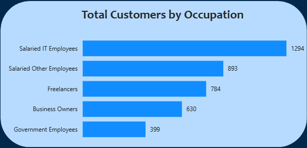

**Main Insight 4**

Income Distribution:
- 60K+ → 38% (largest income bracket)
- 30K–40K → 27%
- 20K–30K → 5% (smallest)

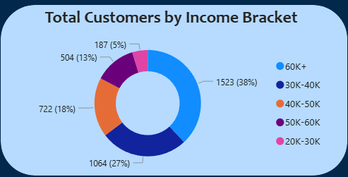

So, the customer base is dominated by salaried professionals in early-to-mid career stages — ideal for structured credit-based products.

---

### 2. Income Utilization & Credit Potential

**Average Monthly Income:** ₹51.65K
**Average Income Utilization:** 43%

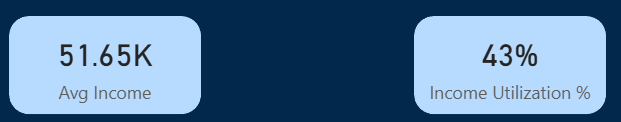

**Main Insight 1**

**High-income customers (60K+)** maintain **high utilization (44%)**, showing strong credit absorption capacity. Also, Income utilization is relatively consistent across income brackets (34%–45%), suggesting spending scales with earnings.

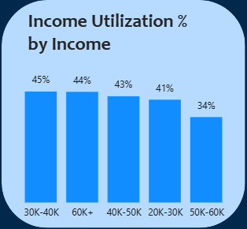

**Main Insight 2**

IT professionals aged 35–45 show the highest utilization (55%).

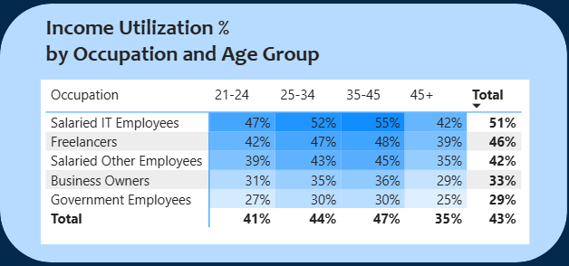

**Main Insight 3**

Certain metro cities demonstrate higher utilization (above 48%), indicating strong credit card potential.

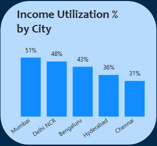

This indicates that higher earners are not conservative spenders — they represent ideal candidates for premium or reward-based credit cards.

---

### 3. Spending & Payment Behavior
**Total Spend:** ₹531M
**Average Monthly Spend:** ₹22.12K
**Credit Card Spend :** ₹216M
**Credit Card Usage:** 41% of total spend

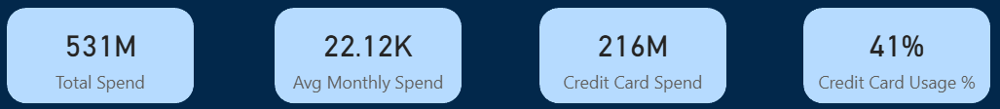

**Main Insight 1**

Spending trend peaks in September, indicating seasonal influence.

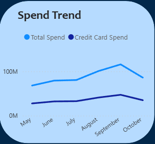

**Main Insight 2**

**Credit cards** dominate **Bills and Electronics** spending. **UPI** strongly competes in **Groceries** category — indicating incentive opportunity.

Top Spending Categories:
- Bills
- Groceries
- Electronics
- Health & Wellness
- Travel

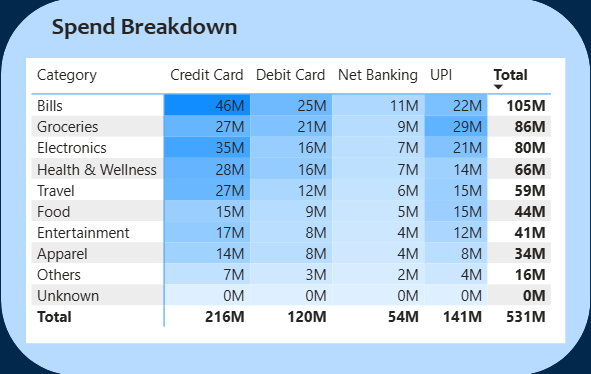

**Main Insight 3**

**Salaried IT employees** have the most contribution in total spend **(₹244M)**, which suggests that they are the most spending group, while **government employees** spend the least among other occupation groups **(₹36M)**.

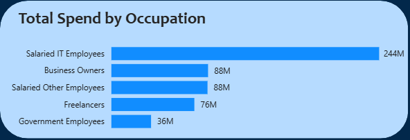

**Main Insight 4**

**Credit cards** hold a significant share of the total spend, which is **₹216M (41% of total spend)**. On second and third payment modes, we have **UPI** and **Debit Cards** with **₹141M (27% of total spend)** and **₹120M (23% of total spend)**, respectively.

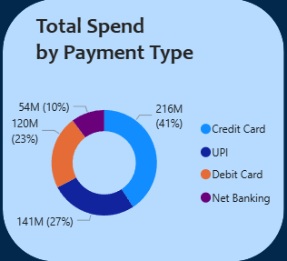

**Main Insight 5**

The age group **25-34** seems to spend the most **(₹204M)**, and their preferred payment mode seems to be **Credit Cards**, followed by **UPI and Debit Cards**. The other age group follows a similar preferance of payment modes. 

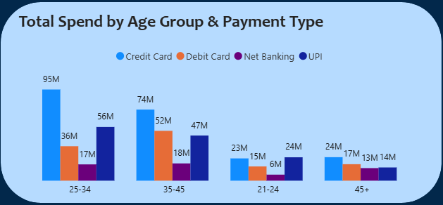

All this indicates  that customers are already comfortable using credit cards, but strategic rewards in competitive categories can significantly increase adoption.

---

## Recommendations  
- Launch initially in **high-utilization metro cities** like **Mumbai, Delhi, and Bangalore**.
- Target **salaried IT professionals, salaried other professionals, and business owners aged 25–45**.
- Introduce **cashback or rewards** in **groceries, dining, and entertainment** to compete with UPI.
- Offer **enhanced benefits** on **bills, electronics, travel, and health categories**.
- Align launch timeline with **peak seasonal spending months (pre-festive period)**.

---

## Assumptions & Caveats  
- The dataset covers only six months of transaction history.
- Pilot dataset includes 4,000 customers only.
- Income utilization assumes a stable monthly income.
- Outliers were treated using median-based methods.

---

## Tools Used  
- Python (Pandas, NumPy, Matplotlib, Seaborn)
- Jupyter Notebook
- PostgreSQL
- Power BI

---

## Project Outcome  
This project demonstrates:
- End-to-end data cleaning & transformation
- SQL-based business querying
- KPI creation & metric design
- Executive-level dashboard storytelling
- Strategic product recommendation

The analysis provides a structured, data-backed approach for optimizing credit card product strategy within the banking industry.
